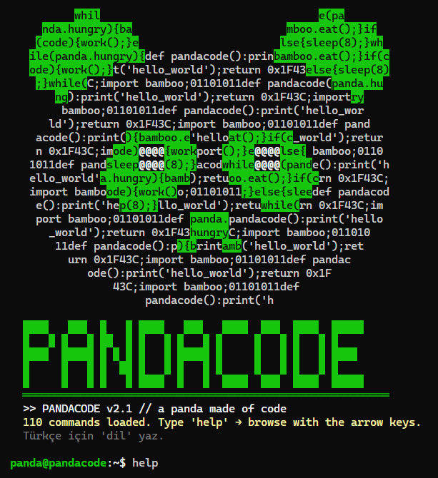
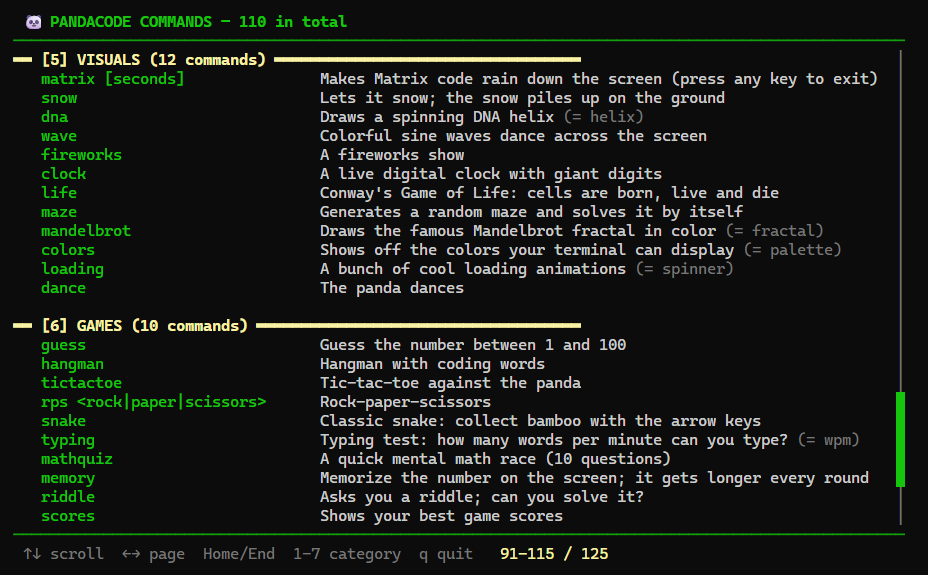
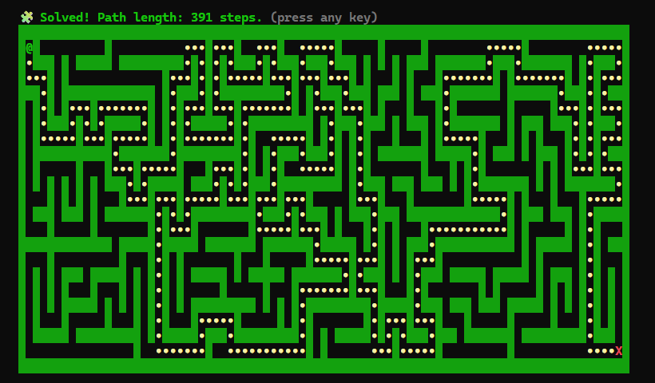

# 🐼 PandaCode

**English** | [Türkçe](README.tr.md)

**The terminal of a panda made of code.** A single-file, colorful, interactive Python terminal with 110 commands: tools, ciphers, games, animations and mini Python lessons. No extra libraries needed.



## Install and run

All you need is Python 3.8 or newer.

```bash
git clone https://github.com/pandakingpunc/pandacode.git
cd pandacode
python pandacode.py
```

> **Note:** Run it in Windows Terminal, CMD, PowerShell, the VS Code terminal or a Linux/macOS terminal. Arrow keys and animations don't work in editors like IDLE.

## English or Turkish

PandaCode speaks English by default. Type `dil` (or `lang`) to switch to Turkish, and type it again to switch back. Your choice is saved, so PandaCode opens in the same language next time.

Every command has an English and a Turkish name, and both always work: `help` = `yardim`, `calc` = `hesapla`, `snake` = `yilan`…

## Scrollable help menu

Type `help` to see every command full screen, grouped by category.

| Key | Action |
|---|---|
| `↑` `↓` | Scroll line by line |
| `←` `→` / `PgUp` `PgDn` | Scroll page by page |
| `1` - `7` | Jump to a category |
| `Home` / `End` | Go to the top / bottom |
| `q` / `Esc` | Quit |

`help caesar` shows the details of one command; a category like `help games` or any word like `help text` lists the matching commands.



## Commands

| Category | What's inside? |
|---|---|
| **System** (22) | Live CPU/RAM/disk panel (`system`), calendar, history, `repeat`, saved color themes (`theme purple`), prompt name (`name`), language (`lang`) |
| **Tools** (31) | Safe calculator (`calc (3+4)*2^3`), password generator and strength checker, saved notes, giant-digit countdown, stopwatch, prime factors, age/day counters, temperature, color code preview |
| **Ciphers** (15) | Caesar cipher with an automatic cracker (`caesarcrack`), Vigenère, ROT13, Morse, binary, hex, base64, ASCII table |
| **Fun** (14) | A talking panda (`pandasay`), programmer jokes, coding fortunes, magic 8-ball, ASCII dice, rainbow/glitch text, giant-letter banners |
| **Visuals** (12) | Matrix rain, snow, fireworks, DNA helix, Conway's Game of Life, a self-solving maze, the Mandelbrot fractal, a dancing panda |
| **Games** (10) | Snake (with the arrow keys), tic-tac-toe against the panda, hangman, typing speed test, memory, riddles, mental math; high scores are saved |
| **Learn** (6) | Mini Python lessons with example code (`learn loops`), a Python quiz, git/terminal/keyboard cheat sheets, HTTP status codes, port numbers |



## Little details

- Mistype a command and it asks *"Did you mean…?"*
- Typing a slash first works too: `/help`, `/dil`.
- `Ctrl+C` stops a running animation; press it at the prompt and the panda says goodbye.
- Notes, theme, name, language and high scores are stored in `pandacode_veri.json` next to the program (this file isn't added to git).

## Adding a new command

The source code uses Turkish names (`komut` = command, `soyle` = say, `tr_en` = pick Turkish or English). Every command is a function registered with the `@komut` decorator, and it shows up in the help menu automatically:

```python
@komut("selam", "hello hi", "Eğlence",
       "Pandaya selam verir", "Says hello to the panda",
       "[isim]", "[name]")
def k_selam(arg):
    soyle(tr_en(f"Selam {arg or 'dostum'}! 🐼", f"Hello {arg or 'friend'}! 🐼"))
```

The arguments are: Turkish name, English name, category, Turkish and English description, Turkish and English usage. Extra names after a space become aliases (`hi` above). The category is one of the Turkish keys in `KATEGORILER`, for example `"Eğlence"` (Fun) or `"Oyunlar"` (Games).

## License

[MIT](LICENSE)
