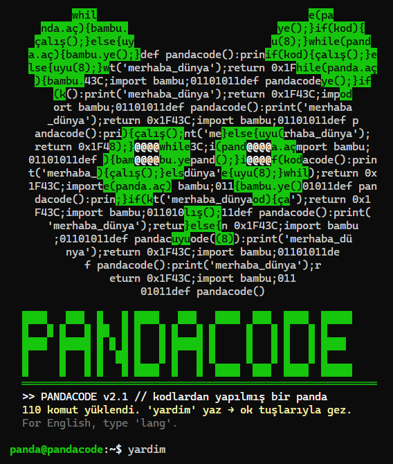
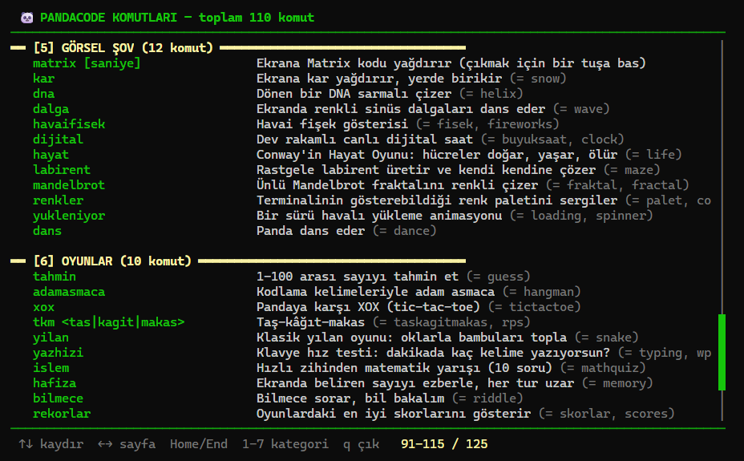
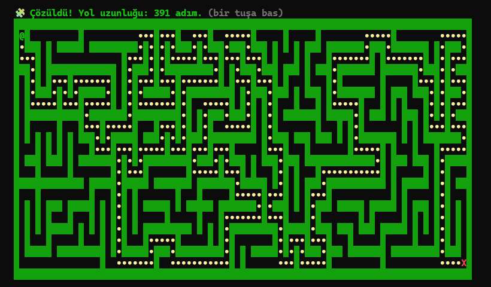

# 🐼 PandaCode

[English](README.md) | **Türkçe**

**Kodlardan yapılmış bir pandanın terminali.** 110 komutlu, tek dosyalık, renkli ve interaktif bir Python terminal aracı: araçlar, şifreleme, oyunlar, animasyonlar ve mini Python dersleri. Hiçbir ek kütüphane gerektirmez.



## Kurulum ve çalıştırma

Sadece Python 3.8 veya üstü gerekiyor.

```bash
git clone https://github.com/pandakingpunc/pandacode.git
cd pandacode
python pandacode.py
```

> **Not:** Windows Terminal, CMD, PowerShell, VS Code terminali veya Linux/macOS terminalinde çalıştır. IDLE gibi editörlerde ok tuşları ve animasyonlar çalışmaz.

## Türkçe mi İngilizce mi?

PandaCode varsayılan olarak İngilizce açılır. `dil` yazınca Türkçeye geçer, tekrar yazınca İngilizceye döner. Seçimin kaydedilir; bir dahaki açılışta aynı dilde başlar.

Her komutun Türkçe ve İngilizce bir adı var ve ikisi de her zaman çalışır: `yardim` = `help`, `hesapla` = `calc`, `yilan` = `snake`…

## Kaydırılabilir yardım menüsü

`yardim` yaz; tüm komutlar tam ekran, kategorilere ayrılmış şekilde açılır.

| Tuş | İşlev |
|---|---|
| `↑` `↓` | Satır satır kaydır |
| `←` `→` / `PgUp` `PgDn` | Sayfa sayfa kaydır |
| `1` - `7` | Doğrudan kategoriye atla |
| `Home` / `End` | Başa / sona git |
| `q` / `Esc` | Çık |

`yardim sezar` bir komutun detayını, `yardim oyun` gibi bir kelime ise arama sonucunu gösterir.



## Komutlar

| Kategori | Neler var? |
|---|---|
| **Sistem** (22) | Canlı CPU/RAM/disk paneli (`sistem`), takvim, geçmiş, `tekrar`, kalıcı renk teması (`tema mor`), prompt adı (`isim`), dil (`dil`) |
| **Araçlar** (31) | Güvenli hesap makinesi (`hesapla (3+4)*2^3`), şifre üretici ve güç ölçer, kalıcı notlar, dev rakamlı geri sayım, kronometre, asal çarpanlar, yaş/gün hesabı, sıcaklık, renk kodu önizleme |
| **Şifreleme** (15) | Türk alfabesiyle Sezar şifresi ve otomatik kırıcı (`sezarkir`), Vigenère, ROT13, mors, binary, hex, base64, ASCII tablosu |
| **Eğlence** (14) | Konuşan panda (`pandade`), programcı fıkraları, kod falı, sihirli 8 topu, ASCII zar, gökkuşağı/glitch yazı, dev harfli banner |
| **Görsel Şov** (12) | Matrix yağmuru, kar, havai fişek, DNA sarmalı, Conway'in Hayat Oyunu, kendini çözen labirent, Mandelbrot fraktalı, dans eden panda |
| **Oyunlar** (10) | Yılan (ok tuşlarıyla), pandaya karşı XOX, adam asmaca, klavye hız testi, hafıza, bilmece, zihinden matematik; rekorlar kaydedilir |
| **Öğren** (6) | Örnek kodlu mini Python dersleri (`ogren dongu`), Python quiz, git/terminal/klavye kopya kâğıtları, HTTP kodları, port numaraları |



## Küçük ayrıntılar

- Komutları Türkçe karakterle de yazabilirsin: `yardım`, `çıkış`, `şifre`…
- Başına `/` koyarsan da olur: `/dil`, `/yardim`.
- Yanlış yazarsan *"Bunu mu demek istedin?"* diye önerir.
- `Ctrl+C` çalışan bir animasyonu durdurur; komut satırında basarsan panda vedalaşıp kapanır.
- Notlar, tema, ad, dil ve oyun rekorları programın yanındaki `pandacode_veri.json` dosyasında saklanır (bu dosya git'e eklenmez).

## Yeni komut eklemek

Her komut, `@komut` süsleyicisiyle kaydedilen bir fonksiyondur. Eklediğin komut yardım menüsüne kendiliğinden girer. Mesajları `tr_en(türkçe, ingilizce)` ile iki dilde yazarsın:

```python
@komut("selam", "hello hi", "Eğlence",
       "Pandaya selam verir", "Says hello to the panda",
       "[isim]", "[name]")
def k_selam(arg):
    soyle(tr_en(f"Selam {arg or 'dostum'}! 🐼", f"Hello {arg or 'friend'}! 🐼"))
```

Sırasıyla: Türkçe ad, İngilizce ad, kategori, Türkçe ve İngilizce açıklama, Türkçe ve İngilizce kullanım. Addan sonra boşlukla yazılan kelimeler takma ad olur (yukarıdaki `hi` gibi).

## Lisans

[MIT](LICENSE)
